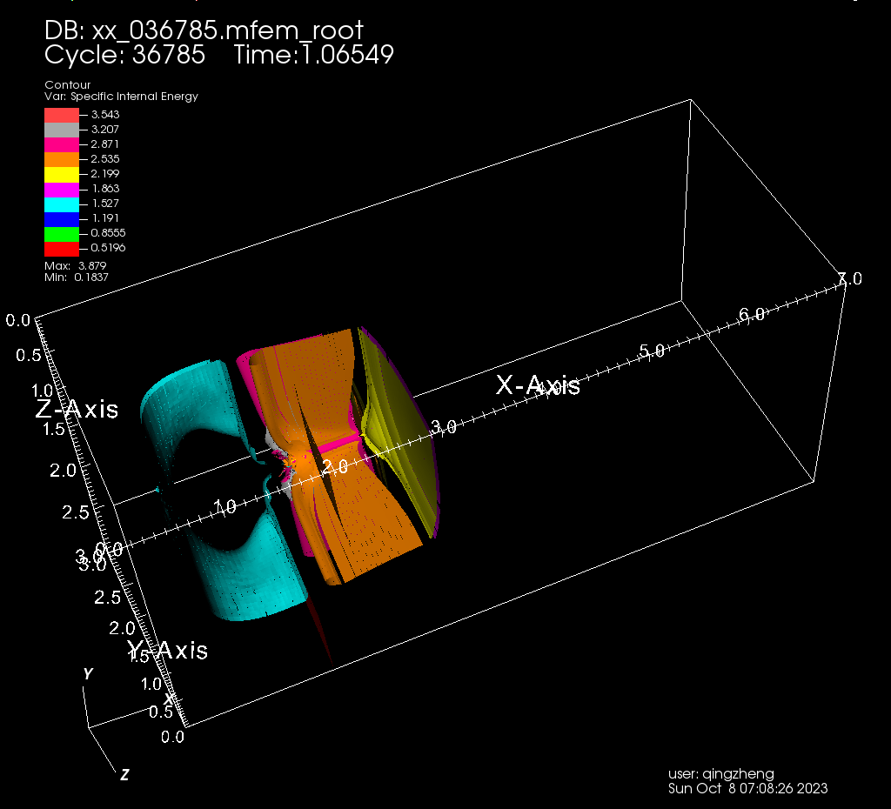
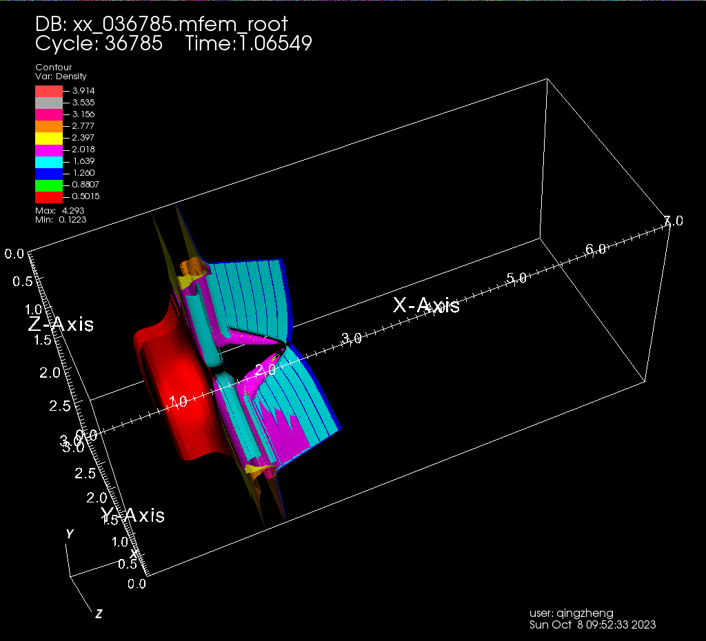
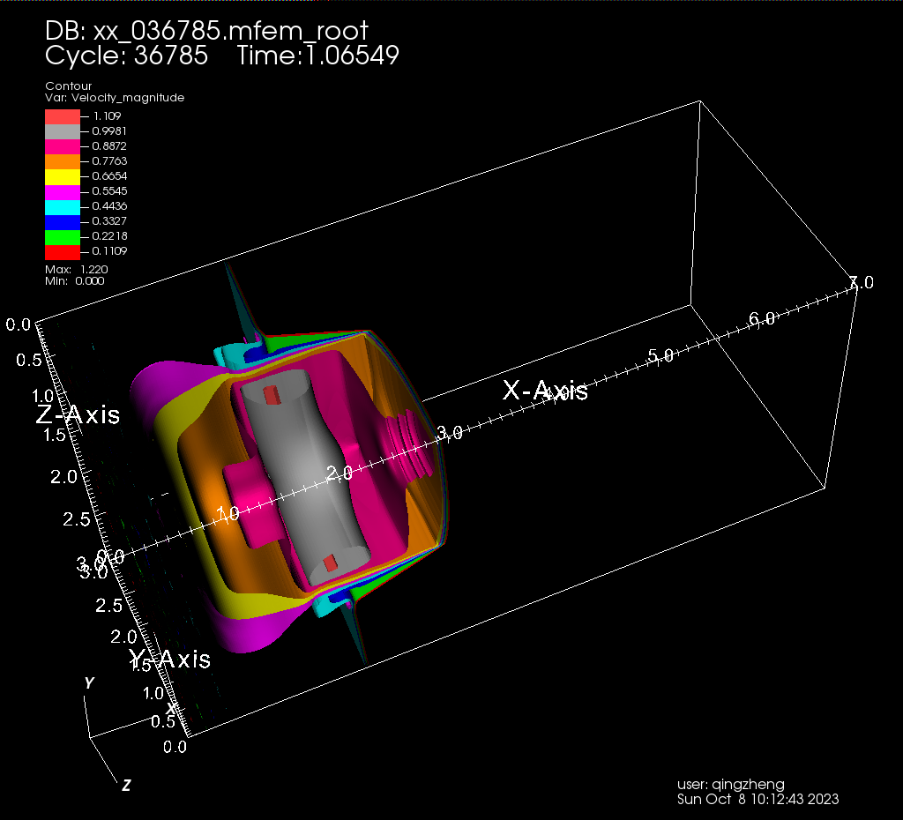

**A sample laghos 3D mesh dataset for local OCS development and testing**

[](https://creativecommons.org/licenses/by/4.0/)

OCS Laghos Sample Dataset
=

```
XX              XXXXX XXX         XX XX           XX       XX XX XXX         XXX
XX             XXX XX XXXX        XX XX           XX       XX XX    XX     XX   XX
XX            XX   XX XX XX       XX XX           XX       XX XX      XX XX       XX
XX           XX    XX XX  XX      XX XX           XX       XX XX      XX XX       XX
XX          XX     XX XX   XX     XX XX           XX XXXXX XX XX      XX XX       XX
XX         XX      XX XX    XX    XX XX           XX       XX XX     XX  XX
XX        XX       XX XX     XX   XX XX           XX       XX XX    XX   XX
XX       XX XX XX XXX XX      XX  XX XX           XX XXXXX XX XX XXX     XX       XX
XX      XX         XX XX       XX XX XX           XX       XX XX         XX       XX
XX     XX          XX XX        X XX XX           XX       XX XX         XX       XX
XX    XX           XX XX          XX XX           XX       XX XX          XX     XX
XXXX XX            XX XX          XX XXXXXXXXXX   XX       XX XX            XXXXXX
```

This sample dataset is generated by running the open source Laghos miniapp using a single MPI process on a single node with result rewritten into Apache Parquet. A total of 524,287 mesh elements, 612,310 vertices, and 4,194,304 data points were simulated and recorded.

**The dataset currently consists of a single parquet file, which stores the simulation state of timestep 36785.**

This parquet file consists of a single row group, 4M rows, and 10 columns (details below). Each column comprises 16-32 Snappy compressed parquet pages. Applying Snappy compression reduces the size of the parquet file from 288MB to 97MB. Before uploading to github, the parquet file is additionally compressed using Brotli. This further reduces the parquet file size from 97MB to 39MB (so github does not complain file being too large).

To recover the parquet file from its Brotli compressed form:

```bash
brotli -d <parquet_file>.br
```

For example:

```bash
brotli -d xx_036785.parquet.br
```

On Ubuntu, brotli can be installed through APT:

```bash
sudo apt-get install brotli
```

Schema and Statistics
=

See below for a quick metadata dump of the sample parquet file.

```
File path:  xx_036785.parquet
Created by: parquet-cpp-arrow version 13.0.0
Properties: (none)
Schema:
message schema {
  required int32 element_id (INTEGER(32,true));
  required int32 vertex_id (INTEGER(32,true));
  required double v_x;
  required double v_y;
  required double v_z;
  required double rho;
  required double e;
  required double x;
  required double y;
  required double z;
}


Row group 0:  count: 4194304  24.24 B records  start: 4  total(compressed): 96.949 MB total(uncompressed):288.018 MB 
--------------------------------------------------------------------------------
            type      encodings count     avg size   nulls   min / max
element_id  INT32     S   _     4194304   0.88 B     0       "0" / "524287"
vertex_id   INT32     S   _     4194304   2.03 B     0       "0" / "612310"
v_x         DOUBLE    S   _     4194304   2.79 B     0       "-5.0671622E-4" / "1.21735"
v_y         DOUBLE    S   _     4194304   2.78 B     0       "-0.39468541" / "0.39289976"
v_z         DOUBLE    S   _     4194304   2.75 B     0       "-0.3974602" / "0.38954242"
rho         DOUBLE    S   _     4194304   3.98 B     0       "0.12228425" / "4.2933597"
e           DOUBLE    S   _     4194304   3.96 B     0       "0.18369001" / "3.8787233"
x           DOUBLE    S   _     4194304   1.84 B     0       "-0.0" / "7.0"
y           DOUBLE    S   _     4194304   1.68 B     0       "-0.0" / "3.0"
z           DOUBLE    S   _     4194304   1.55 B     0       "-0.0" / "3.0"
```

Sample DuckDB SQL Query
=

```sql
SELECT min(vertex_id) AS VID, min(x) as X, min(y) as Y, min(z) as Z, avg(e) AS E
FROM 'xx_036785.parquet'
WHERE x > 1.5 AND x < 1.6 AND y > 1.5 AND y < 1.6 AND z > 1.5 AND z < 1.6
GROUP BY vertex_id ORDER BY E;
```

## Query Result

```
┌────────┬────────────────────┬────────────────────┬────────────────────┬────────────────────┐
│  VID   │         X          │         Y          │         Z          │         E          │
│ int32  │       double       │       double       │       double       │       double       │
├────────┼────────────────────┼────────────────────┼────────────────────┼────────────────────┤
│ 166462 │          1.5645773 │ 1.5376104999999998 │ 1.5803627999999998 │ 1.4755714125000001 │
│ 240662 │ 1.5611519000000003 │ 1.5749507000000003 │ 1.5417632999999997 │       1.4774999125 │
│ 219780 │ 1.5264729999999997 │          1.5887712 │          1.5934969 │       1.4871300875 │
│ 240660 │           1.503907 │ 1.5975798999999997 │ 1.5078072999999999 │       1.4890849375 │
│ 159440 │          1.5057572 │          1.5352168 │           1.556996 │         1.49520745 │
│ 233498 │          1.5047735 │          1.5526603 │          1.5391836 │         1.49543775 │
│ 212414 │          1.5057572 │          1.5352168 │           1.556996 │        1.495636475 │
│ 212409 │          1.5047735 │          1.5526603 │          1.5391836 │ 1.4960388500000001 │
└────────┴────────────────────┴────────────────────┴────────────────────┴────────────────────┘
```

VisIt Results (so we get a sense of how the data looks like)
=

Results of using LLNL's [VisIt](https://visit-dav.github.io/visit-website/index.html) on the dataset's energy (e), density (rho), and velocity (v_x, v_y, v_z) columns.

| Energy (e) | Density (rho) | Velocity (v_x, v_y, v_z) |
| :---: | :---: | :---: |
|  |  |  |

Acknowledgement
=

Laghos (LAGrangian High-Order Solver) is a miniapp that solves the time-dependent Euler equations of compressible gas dynamics in a moving Lagrangian frame using unstructured high-order finite element spatial discretization and explicit high-order time-stepping. It is built on top of a general discretization library, [MFEM](http://mfem.org).

The Laghos miniapp is part of the [CEED software suite](http://ceed.exascaleproject.org/software), a collection of software benchmarks, miniapps, libraries, and APIs for efficient exascale discretizations based on high-order finite element and spectral element methods.

The CEED research is funded by the U.S. Department of Energy/Exascale Computing Project, an effort responsible for the planning and preparation of a capable exascale ecosystem, including software, applications, hardware, advanced system engineering, and early testbed platforms, in support of the nation’s exascale computing imperative.

VisIt is an open-source, interactive, scalable, visualization, animation, and analysis tool developed by Lawrence Livermore National Laboratory.
VisIt is supported by the U.S. Department of Energy with fundings from the Advanced Simulation and Computing Program, the Scientific Discovery through Advanced Computing Program, and the Exascale Computing Project.

[DuckDB](https://duckdb.org/) is an open source high-performance analytical database system.

This sample dataset is prepared by an employee of Triad National Security, LLC which operates Los Alamos National Laboratory for the U.S. Department of Energy/National Nuclear Security Administration.

Appendix
=

The command we used to run Laghos was `mpirun -np 32 ./laghos -p 3 -m data/box01_hex.mesh -rs 2 -rp 3 -tf 5.0 -pa -visit -print -k <datadir>`.

Detailed page-level information of the sample parquet file:

```
Column: element_id
--------------------------------------------------------------------------------
  page   type  enc  count   avg size   size       rows     nulls   min / max
  0-0    data  S _  262144  4.00 B     1024.000 kB          0       "0" / "32767"
  0-1    data  S _  262144  4.00 B     1024.000 kB          0       "32768" / "65535"
  0-2    data  S _  262144  4.00 B     1024.000 kB          0       "65536" / "98303"
  0-3    data  S _  262144  4.00 B     1024.000 kB          0       "98304" / "131071"
  0-4    data  S _  262144  4.00 B     1024.000 kB          0       "131072" / "163839"
  0-5    data  S _  262144  4.00 B     1024.000 kB          0       "163840" / "196607"
  0-6    data  S _  262144  4.00 B     1024.000 kB          0       "196608" / "229375"
  0-7    data  S _  262144  4.00 B     1024.000 kB          0       "229376" / "262143"
  0-8    data  S _  262144  4.00 B     1024.000 kB          0       "262144" / "294911"
  0-9    data  S _  262144  4.00 B     1024.000 kB          0       "294912" / "327679"
  0-10   data  S _  262144  4.00 B     1024.000 kB          0       "327680" / "360447"
  0-11   data  S _  262144  4.00 B     1024.000 kB          0       "360448" / "393215"
  0-12   data  S _  262144  4.00 B     1024.000 kB          0       "393216" / "425983"
  0-13   data  S _  262144  4.00 B     1024.000 kB          0       "425984" / "458751"
  0-14   data  S _  262144  4.00 B     1024.000 kB          0       "458752" / "491519"
  0-15   data  S _  262144  4.00 B     1024.000 kB          0       "491520" / "524287"


Column: vertex_id
--------------------------------------------------------------------------------
  page   type  enc  count   avg size   size       rows     nulls   min / max
  0-0    data  S _  262144  4.00 B     1024.000 kB          0       "0" / "37497"
  0-1    data  S _  262144  4.00 B     1024.000 kB          0       "37498" / "76283"
  0-2    data  S _  262144  4.00 B     1024.000 kB          0       "76284" / "114261"
  0-3    data  S _  262144  4.00 B     1024.000 kB          0       "114262" / "152559"
  0-4    data  S _  262144  4.00 B     1024.000 kB          0       "152560" / "190521"
  0-5    data  S _  262144  4.00 B     1024.000 kB          0       "190522" / "228555"
  0-6    data  S _  262144  4.00 B     1024.000 kB          0       "228556" / "266381"
  0-7    data  S _  262144  4.00 B     1024.000 kB          0       "266382" / "304087"
  0-8    data  S _  262144  4.00 B     1024.000 kB          0       "304088" / "342785"
  0-9    data  S _  262144  4.00 B     1024.000 kB          0       "342786" / "380563"
  0-10   data  S _  262144  4.00 B     1024.000 kB          0       "380564" / "418301"
  0-11   data  S _  262144  4.00 B     1024.000 kB          0       "418302" / "456127"
  0-12   data  S _  262144  4.00 B     1024.000 kB          0       "456128" / "494937"
  0-13   data  S _  262144  4.00 B     1024.000 kB          0       "494938" / "534363"
  0-14   data  S _  262144  4.00 B     1024.000 kB          0       "534364" / "573484"
  0-15   data  S _  262144  4.00 B     1024.000 kB          0       "573485" / "612310"


Column: v_x
--------------------------------------------------------------------------------
  page   type  enc  count   avg size   size       rows     nulls   min / max
  0-0    data  S _  131072  8.00 B     1024.000 kB          0       "-1.9169282E-4" / "0.90284546"
  0-1    data  S _  131072  8.00 B     1024.000 kB          0       "-2.5815179E-7" / "1.0201876"
  0-2    data  S _  131072  8.00 B     1024.000 kB          0       "-3.8990478E-4" / "0.90195536"
  0-3    data  S _  131072  8.00 B     1024.000 kB          0       "-5.0671622E-4" / "0.90889251"
  0-4    data  S _  131072  8.00 B     1024.000 kB          0       "-0.0" / "1.061023"
  0-5    data  S _  131072  8.00 B     1024.000 kB          0       "0.32894836" / "1.1904011"
  0-6    data  S _  131072  8.00 B     1024.000 kB          0       "-3.8990478E-4" / "1.1403112"
  0-7    data  S _  131072  8.00 B     1024.000 kB          0       "-0.0" / "1.0902209"
  0-8    data  S _  131072  8.00 B     1024.000 kB          0       "-0.0" / "1.129982"
  0-9    data  S _  131072  8.00 B     1024.000 kB          0       "-0.0" / "0.89292557"
  0-10   data  S _  131072  8.00 B     1024.000 kB          0       "-8.3095403E-8" / "1.1366074"
  0-11   data  S _  131072  8.00 B     1024.000 kB          0       "0.20207826" / "1.2116347"
  0-12   data  S _  131072  8.00 B     1024.000 kB          0       "-1.8682703E-4" / "1.21735"
  0-13   data  S _  131072  8.00 B     1024.000 kB          0       "-1.6552538E-4" / "1.081117"
  0-14   data  S _  131072  8.00 B     1024.000 kB          0       "-0.0" / "0.84955241"
  0-15   data  S _  131072  8.00 B     1024.000 kB          0       "-0.0" / "1.1330516"
  0-16   data  S _  131072  8.00 B     1024.000 kB          0       "-2.2900169E-14" / "1.4582455E-14"
  0-17   data  S _  131072  8.00 B     1024.000 kB          0       "-2.5605891E-14" / "4.6569517E-14"
  0-18   data  S _  131072  8.00 B     1024.000 kB          0       "-2.4396136E-14" / "7.306462E-14"
  0-19   data  S _  131072  8.00 B     1024.000 kB          0       "-2.5031749E-14" / "7.9180897E-14"
  0-20   data  S _  131072  8.00 B     1024.000 kB          0       "-1.2872914E-5" / "0.0041900254"
  0-21   data  S _  131072  8.00 B     1024.000 kB          0       "-1.3666414E-4" / "0.8930101"
  0-22   data  S _  131072  8.00 B     1024.000 kB          0       "-3.2406407E-7" / "1.110702E-5"
  0-23   data  S _  131072  8.00 B     1024.000 kB          0       "-1.3434021E-5" / "0.28533476"
  0-24   data  S _  131072  8.00 B     1024.000 kB          0       "-1.519994E-6" / "1.1632537E-4"
  0-25   data  S _  131072  8.00 B     1024.000 kB          0       "-6.1112164E-11" / "3.5409217E-11"
  0-26   data  S _  131072  8.00 B     1024.000 kB          0       "-2.2622248E-14" / "3.4682513E-14"
  0-27   data  S _  131072  8.00 B     1024.000 kB          0       "-2.6461801E-6" / "1.3031086E-4"
  0-28   data  S _  131072  8.00 B     1024.000 kB          0       "-1.0309008E-14" / "2.7406559E-14"
  0-29   data  S _  131072  8.00 B     1024.000 kB          0       "-2.6190651E-14" / "4.7983339E-14"
  0-30   data  S _  131072  8.00 B     1024.000 kB          0       "-1.3082658E-11" / "6.4906258E-12"
  0-31   data  S _  131072  8.00 B     1024.000 kB          0       "-4.1766785E-7" / "3.6075055E-6"


Column: v_y
--------------------------------------------------------------------------------
  page   type  enc  count   avg size   size       rows     nulls   min / max
  0-0    data  S _  131072  8.00 B     1024.000 kB          0       "-0.083469992" / "0.24645918"
  0-1    data  S _  131072  8.00 B     1024.000 kB          0       "-0.14399694" / "0.27026499"
  0-2    data  S _  131072  8.00 B     1024.000 kB          0       "-0.28183336" / "0.16089539"
  0-3    data  S _  131072  8.00 B     1024.000 kB          0       "-0.28162315" / "0.1671954"
  0-4    data  S _  131072  8.00 B     1024.000 kB          0       "-0.16526467" / "0.11891409"
  0-5    data  S _  131072  8.00 B     1024.000 kB          0       "-0.30521354" / "0.23093304"
  0-6    data  S _  131072  8.00 B     1024.000 kB          0       "-0.29319484" / "0.39289976"
  0-7    data  S _  131072  8.00 B     1024.000 kB          0       "-0.024838539" / "0.11409971"
  0-8    data  S _  131072  8.00 B     1024.000 kB          0       "-0.21306384" / "0.39153201"
  0-9    data  S _  131072  8.00 B     1024.000 kB          0       "-0.0098166435" / "0.15405502"
  0-10   data  S _  131072  8.00 B     1024.000 kB          0       "-0.28191339" / "0.15668015"
  0-11   data  S _  131072  8.00 B     1024.000 kB          0       "-0.24652906" / "0.32023116"
  0-12   data  S _  131072  8.00 B     1024.000 kB          0       "-0.39468541" / "0.27026499"
  0-13   data  S _  131072  8.00 B     1024.000 kB          0       "-0.044146482" / "0.018955368"
  0-14   data  S _  131072  8.00 B     1024.000 kB          0       "-0.20962508" / "0.037868266"
  0-15   data  S _  131072  8.00 B     1024.000 kB          0       "-0.3295311" / "0.20397694"
  0-16   data  S _  131072  8.00 B     1024.000 kB          0       "-3.4408847E-14" / "1.554397E-14"
  0-17   data  S _  131072  8.00 B     1024.000 kB          0       "-5.5988866E-14" / "6.8597896E-14"
  0-18   data  S _  131072  8.00 B     1024.000 kB          0       "-3.5046115E-14" / "6.2429531E-14"
  0-19   data  S _  131072  8.00 B     1024.000 kB          0       "-5.6518351E-14" / "9.1740979E-14"
  0-20   data  S _  131072  8.00 B     1024.000 kB          0       "-1.3572159E-4" / "1.9415904E-5"
  0-21   data  S _  131072  8.00 B     1024.000 kB          0       "-0.25884331" / "0.03016829"
  0-22   data  S _  131072  8.00 B     1024.000 kB          0       "-1.5270404E-6" / "8.6452254E-9"
  0-23   data  S _  131072  8.00 B     1024.000 kB          0       "-0.065949618" / "0.24645918"
  0-24   data  S _  131072  8.00 B     1024.000 kB          0       "-2.9387646E-6" / "8.5051428E-6"
  0-25   data  S _  131072  8.00 B     1024.000 kB          0       "-3.7286763E-12" / "2.0180378E-12"
  0-26   data  S _  131072  8.00 B     1024.000 kB          0       "-5.5080314E-14" / "6.5280995E-14"
  0-27   data  S _  131072  8.00 B     1024.000 kB          0       "-4.2706298E-6" / "8.3287882E-6"
  0-28   data  S _  131072  8.00 B     1024.000 kB          0       "-3.8007679E-14" / "2.7168983E-14"
  0-29   data  S _  131072  8.00 B     1024.000 kB          0       "-5.7530397E-14" / "8.8422378E-14"
  0-30   data  S _  131072  8.00 B     1024.000 kB          0       "-1.1351813E-11" / "2.2977363E-12"
  0-31   data  S _  131072  8.00 B     1024.000 kB          0       "-4.6082717E-9" / "2.61393E-6"


Column: v_z
--------------------------------------------------------------------------------
  page   type  enc  count   avg size   size       rows     nulls   min / max
  0-0    data  S _  131072  8.00 B     1024.000 kB          0       "-0.080160931" / "0.25458253"
  0-1    data  S _  131072  8.00 B     1024.000 kB          0       "-0.13106973" / "0.25458253"
  0-2    data  S _  131072  8.00 B     1024.000 kB          0       "-0.03696732" / "0.27741727"
  0-3    data  S _  131072  8.00 B     1024.000 kB          0       "-0.33268809" / "0.27730644"
  0-4    data  S _  131072  8.00 B     1024.000 kB          0       "-0.158177" / "0.02125795"
  0-5    data  S _  131072  8.00 B     1024.000 kB          0       "-0.32571041" / "0.237855"
  0-6    data  S _  131072  8.00 B     1024.000 kB          0       "-0.3974602" / "0.28949226"
  0-7    data  S _  131072  8.00 B     1024.000 kB          0       "-0.39589594" / "0.089481774"
  0-8    data  S _  131072  8.00 B     1024.000 kB          0       "-0.31871531" / "0.14635907"
  0-9    data  S _  131072  8.00 B     1024.000 kB          0       "-0.01109525" / "0.22724024"
  0-10   data  S _  131072  8.00 B     1024.000 kB          0       "-0.27443193" / "0.17411132"
  0-11   data  S _  131072  8.00 B     1024.000 kB          0       "-0.23795717" / "0.32436527"
  0-12   data  S _  131072  8.00 B     1024.000 kB          0       "-0.27219352" / "0.36959486"
  0-13   data  S _  131072  8.00 B     1024.000 kB          0       "-0.27468169" / "0.38954242"
  0-14   data  S _  131072  8.00 B     1024.000 kB          0       "-0.20628979" / "0.22379918"
  0-15   data  S _  131072  8.00 B     1024.000 kB          0       "-0.044570232" / "0.040474123"
  0-16   data  S _  131072  8.00 B     1024.000 kB          0       "-3.1627967E-14" / "3.080245E-14"
  0-17   data  S _  131072  8.00 B     1024.000 kB          0       "-4.1215717E-14" / "1.0369708E-13"
  0-18   data  S _  131072  8.00 B     1024.000 kB          0       "-3.0068984E-14" / "5.945095E-14"
  0-19   data  S _  131072  8.00 B     1024.000 kB          0       "-4.1541191E-14" / "1.019128E-13"
  0-20   data  S _  131072  8.00 B     1024.000 kB          0       "-1.5071435E-4" / "1.6544581E-5"
  0-21   data  S _  131072  8.00 B     1024.000 kB          0       "-0.25090261" / "0.24176326"
  0-22   data  S _  131072  8.00 B     1024.000 kB          0       "-2.5350149E-8" / "2.9292834E-6"
  0-23   data  S _  131072  8.00 B     1024.000 kB          0       "-0.25988283" / "0.030859673"
  0-24   data  S _  131072  8.00 B     1024.000 kB          0       "-1.3003797E-6" / "4.5095437E-6"
  0-25   data  S _  131072  8.00 B     1024.000 kB          0       "-3.4287562E-12" / "2.4882696E-12"
  0-26   data  S _  131072  8.00 B     1024.000 kB          0       "-3.814562E-14" / "6.1306193E-14"
  0-27   data  S _  131072  8.00 B     1024.000 kB          0       "-3.4497767E-6" / "1.4307872E-6"
  0-28   data  S _  131072  8.00 B     1024.000 kB          0       "-2.6084789E-14" / "2.6443275E-14"
  0-29   data  S _  131072  8.00 B     1024.000 kB          0       "-3.8240896E-14" / "6.4833822E-14"
  0-30   data  S _  131072  8.00 B     1024.000 kB          0       "-3.8735716E-13" / "8.3154708E-14"
  0-31   data  S _  131072  8.00 B     1024.000 kB          0       "-4.1689756E-7" / "5.411467E-8"


Column: rho
--------------------------------------------------------------------------------
  page   type  enc  count   avg size   size       rows     nulls   min / max
  0-0    data  S _  131072  8.00 B     1024.000 kB          0       "0.12228425" / "1.0000002"
  0-1    data  S _  131072  8.00 B     1024.000 kB          0       "0.17834672" / "1.9244961"
  0-2    data  S _  131072  8.00 B     1024.000 kB          0       "0.20264464" / "3.557132"
  0-3    data  S _  131072  8.00 B     1024.000 kB          0       "0.20398643" / "4.2933597"
  0-4    data  S _  131072  8.00 B     1024.000 kB          0       "0.24036391" / "0.68693745"
  0-5    data  S _  131072  8.00 B     1024.000 kB          0       "0.18992967" / "0.64073874"
  0-6    data  S _  131072  8.00 B     1024.000 kB          0       "0.1698252" / "3.7384643"
  0-7    data  S _  131072  8.00 B     1024.000 kB          0       "0.35215281" / "0.6942845"
  0-8    data  S _  131072  8.00 B     1024.000 kB          0       "0.32734032" / "0.68576858"
  0-9    data  S _  131072  8.00 B     1024.000 kB          0       "0.44529894" / "0.68303268"
  0-10   data  S _  131072  8.00 B     1024.000 kB          0       "0.12253872" / "3.2860817"
  0-11   data  S _  131072  8.00 B     1024.000 kB          0       "0.1723736" / "0.5581314"
  0-12   data  S _  131072  8.00 B     1024.000 kB          0       "0.21739793" / "3.7140977"
  0-13   data  S _  131072  8.00 B     1024.000 kB          0       "0.35822884" / "3.2864062"
  0-14   data  S _  131072  8.00 B     1024.000 kB          0       "0.51293827" / "0.68946043"
  0-15   data  S _  131072  8.00 B     1024.000 kB          0       "0.34158043" / "0.70213262"
  0-16   data  S _  131072  8.00 B     1024.000 kB          0       "0.125" / "1.0"
  0-17   data  S _  131072  8.00 B     1024.000 kB          0       "0.125" / "1.0"
  0-18   data  S _  131072  8.00 B     1024.000 kB          0       "0.125" / "0.125"
  0-19   data  S _  131072  8.00 B     1024.000 kB          0       "0.125" / "1.0"
  0-20   data  S _  131072  8.00 B     1024.000 kB          0       "0.12493198" / "0.12525587"
  0-21   data  S _  131072  8.00 B     1024.000 kB          0       "0.12238978" / "2.1948283"
  0-22   data  S _  131072  8.00 B     1024.000 kB          0       "0.99999926" / "1.000003"
  0-23   data  S _  131072  8.00 B     1024.000 kB          0       "0.96151955" / "2.0813858"
  0-24   data  S _  131072  8.00 B     1024.000 kB          0       "0.12499749" / "1.0"
  0-25   data  S _  131072  8.00 B     1024.000 kB          0       "0.125" / "1.0"
  0-26   data  S _  131072  8.00 B     1024.000 kB          0       "0.125" / "1.0"
  0-27   data  S _  131072  8.00 B     1024.000 kB          0       "0.12499718" / "1.0"
  0-28   data  S _  131072  8.00 B     1024.000 kB          0       "0.125" / "1.0"
  0-29   data  S _  131072  8.00 B     1024.000 kB          0       "0.125" / "1.0"
  0-30   data  S _  131072  8.00 B     1024.000 kB          0       "0.125" / "1.0"
  0-31   data  S _  131072  8.00 B     1024.000 kB          0       "0.125" / "1.0000008"


Column: e
--------------------------------------------------------------------------------
  page   type  enc  count   avg size   size       rows     nulls   min / max
  0-0    data  S _  131072  8.00 B     1024.000 kB          0       "0.24999998" / "3.0982606"
  0-1    data  S _  131072  8.00 B     1024.000 kB          0       "0.19843983" / "3.4717197"
  0-2    data  S _  131072  8.00 B     1024.000 kB          0       "0.24194334" / "2.7275318"
  0-3    data  S _  131072  8.00 B     1024.000 kB          0       "0.23482771" / "2.7756455"
  0-4    data  S _  131072  8.00 B     1024.000 kB          0       "1.3394984" / "3.0225651"
  0-5    data  S _  131072  8.00 B     1024.000 kB          0       "1.306622" / "3.2342713"
  0-6    data  S _  131072  8.00 B     1024.000 kB          0       "0.1936645" / "3.8787233"
  0-7    data  S _  131072  8.00 B     1024.000 kB          0       "1.2579929" / "1.6712435"
  0-8    data  S _  131072  8.00 B     1024.000 kB          0       "1.264484" / "1.6600191"
  0-9    data  S _  131072  8.00 B     1024.000 kB          0       "1.3444941" / "1.6576543"
  0-10   data  S _  131072  8.00 B     1024.000 kB          0       "0.19465294" / "3.3892952"
  0-11   data  S _  131072  8.00 B     1024.000 kB          0       "1.3118924" / "2.7901287"
  0-12   data  S _  131072  8.00 B     1024.000 kB          0       "0.18369001" / "3.2539055"
  0-13   data  S _  131072  8.00 B     1024.000 kB          0       "0.18493135" / "1.6459706"
  0-14   data  S _  131072  8.00 B     1024.000 kB          0       "1.4491219" / "1.6652637"
  0-15   data  S _  131072  8.00 B     1024.000 kB          0       "1.3095893" / "1.6799578"
  0-16   data  S _  131072  8.00 B     1024.000 kB          0       "0.2" / "1.6"
  0-17   data  S _  131072  8.00 B     1024.000 kB          0       "0.2" / "1.6"
  0-18   data  S _  131072  8.00 B     1024.000 kB          0       "1.6" / "1.6"
  0-19   data  S _  131072  8.00 B     1024.000 kB          0       "0.2" / "1.6"
  0-20   data  S _  131072  8.00 B     1024.000 kB          0       "1.5995643" / "1.6016392"
  0-21   data  S _  131072  8.00 B     1024.000 kB          0       "0.24485925" / "2.6318826"
  0-22   data  S _  131072  8.00 B     1024.000 kB          0       "0.19999993" / "0.2000003"
  0-23   data  S _  131072  8.00 B     1024.000 kB          0       "0.19502745" / "0.31709039"
  0-24   data  S _  131072  8.00 B     1024.000 kB          0       "0.25" / "2.0000491"
  0-25   data  S _  131072  8.00 B     1024.000 kB          0       "0.2" / "2.0"
  0-26   data  S _  131072  8.00 B     1024.000 kB          0       "0.2" / "2.0"
  0-27   data  S _  131072  8.00 B     1024.000 kB          0       "0.2" / "2.0000607"
  0-28   data  S _  131072  8.00 B     1024.000 kB          0       "0.25" / "2.0"
  0-29   data  S _  131072  8.00 B     1024.000 kB          0       "0.25" / "2.0"
  0-30   data  S _  131072  8.00 B     1024.000 kB          0       "0.25" / "2.0"
  0-31   data  S _  131072  8.00 B     1024.000 kB          0       "0.24999993" / "2.0"


Column: x
--------------------------------------------------------------------------------
  page   type  enc  count   avg size   size       rows     nulls   min / max
  0-0    data  S _  131072  8.00 B     1024.000 kB          0       "2.5180378" / "4.0"
  0-1    data  S _  131072  8.00 B     1024.000 kB          0       "1.7152871" / "2.6768835"
  0-2    data  S _  131072  8.00 B     1024.000 kB          0       "1.6569456" / "4.0"
  0-3    data  S _  131072  8.00 B     1024.000 kB          0       "1.5034657" / "4.0"
  0-4    data  S _  131072  8.00 B     1024.000 kB          0       "-0.0" / "2.2202571"
  0-5    data  S _  131072  8.00 B     1024.000 kB          0       "0.37872039" / "2.2374962"
  0-6    data  S _  131072  8.00 B     1024.000 kB          0       "0.76347097" / "2.2380053"
  0-7    data  S _  131072  8.00 B     1024.000 kB          0       "-0.0" / "1.873077"
  0-8    data  S _  131072  8.00 B     1024.000 kB          0       "-0.0" / "2.0449598"
  0-9    data  S _  131072  8.00 B     1024.000 kB          0       "-0.0" / "1.3788676"
  0-10   data  S _  131072  8.00 B     1024.000 kB          0       "1.6602722" / "3.0000104"
  0-11   data  S _  131072  8.00 B     1024.000 kB          0       "1.2475067" / "2.4496309"
  0-12   data  S _  131072  8.00 B     1024.000 kB          0       "1.1495205" / "2.6356673"
  0-13   data  S _  131072  8.00 B     1024.000 kB          0       "0.76248657" / "2.5321017"
  0-14   data  S _  131072  8.00 B     1024.000 kB          0       "-0.0" / "1.3528952"
  0-15   data  S _  131072  8.00 B     1024.000 kB          0       "-0.0" / "2.0537265"
  0-16   data  S _  131072  8.00 B     1024.000 kB          0       "4.5" / "6.5"
  0-17   data  S _  131072  8.00 B     1024.000 kB          0       "5.0" / "7.0"
  0-18   data  S _  131072  8.00 B     1024.000 kB          0       "4.5" / "6.0"
  0-19   data  S _  131072  8.00 B     1024.000 kB          0       "5.0" / "7.0"
  0-20   data  S _  131072  8.00 B     1024.000 kB          0       "3.0000036" / "4.5"
  0-21   data  S _  131072  8.00 B     1024.000 kB          0       "2.5" / "4.0"
  0-22   data  S _  131072  8.00 B     1024.000 kB          0       "3.0" / "4.5"
  0-23   data  S _  131072  8.00 B     1024.000 kB          0       "2.5" / "4.0"
  0-24   data  S _  131072  8.00 B     1024.000 kB          0       "3.0" / "5.0"
  0-25   data  S _  131072  8.00 B     1024.000 kB          0       "4.0" / "6.0"
  0-26   data  S _  131072  8.00 B     1024.000 kB          0       "5.0" / "7.0"
  0-27   data  S _  131072  8.00 B     1024.000 kB          0       "3.0" / "7.0"
  0-28   data  S _  131072  8.00 B     1024.000 kB          0       "5.5" / "7.0"
  0-29   data  S _  131072  8.00 B     1024.000 kB          0       "5.0" / "7.0"
  0-30   data  S _  131072  8.00 B     1024.000 kB          0       "4.0" / "6.0"
  0-31   data  S _  131072  8.00 B     1024.000 kB          0       "3.0" / "5.0"


Column: y
--------------------------------------------------------------------------------
  page   type  enc  count   avg size   size       rows     nulls   min / max
  0-0    data  S _  131072  8.00 B     1024.000 kB          0       "-0.0" / "1.5327741"
  0-1    data  S _  131072  8.00 B     1024.000 kB          0       "-0.0" / "1.8751263"
  0-2    data  S _  131072  8.00 B     1024.000 kB          0       "-0.0" / "1.853707"
  0-3    data  S _  131072  8.00 B     1024.000 kB          0       "-0.0" / "1.8719589"
  0-4    data  S _  131072  8.00 B     1024.000 kB          0       "-0.0" / "1.172259"
  0-5    data  S _  131072  8.00 B     1024.000 kB          0       "-0.0" / "1.6059459"
  0-6    data  S _  131072  8.00 B     1024.000 kB          0       "-0.0" / "1.8936863"
  0-7    data  S _  131072  8.00 B     1024.000 kB          0       "-0.0" / "1.1624073"
  0-8    data  S _  131072  8.00 B     1024.000 kB          0       "0.74943475" / "2.2610041"
  0-9    data  S _  131072  8.00 B     1024.000 kB          0       "1.501242" / "3.0"
  0-10   data  S _  131072  8.00 B     1024.000 kB          0       "1.1248718" / "3.0"
  0-11   data  S _  131072  8.00 B     1024.000 kB          0       "1.3451794" / "3.0"
  0-12   data  S _  131072  8.00 B     1024.000 kB          0       "1.0722027" / "2.6247291"
  0-13   data  S _  131072  8.00 B     1024.000 kB          0       "2.2401876" / "3.0"
  0-14   data  S _  131072  8.00 B     1024.000 kB          0       "0.74164291" / "3.0"
  0-15   data  S _  131072  8.00 B     1024.000 kB          0       "1.0571598" / "3.0"
  0-16   data  S _  131072  8.00 B     1024.000 kB          0       "1.5" / "3.0"
  0-17   data  S _  131072  8.00 B     1024.000 kB          0       "1.5" / "3.0"
  0-18   data  S _  131072  8.00 B     1024.000 kB          0       "1.5" / "3.0"
  0-19   data  S _  131072  8.00 B     1024.000 kB          0       "1.125" / "3.0"
  0-20   data  S _  131072  8.00 B     1024.000 kB          0       "1.5" / "3.0"
  0-21   data  S _  131072  8.00 B     1024.000 kB          0       "1.125" / "3.0"
  0-22   data  S _  131072  8.00 B     1024.000 kB          0       "1.5" / "3.0"
  0-23   data  S _  131072  8.00 B     1024.000 kB          0       "1.4943277" / "3.0"
  0-24   data  S _  131072  8.00 B     1024.000 kB          0       "-0.0" / "1.5"
  0-25   data  S _  131072  8.00 B     1024.000 kB          0       "-0.0" / "1.875"
  0-26   data  S _  131072  8.00 B     1024.000 kB          0       "-0.0" / "2.25"
  0-27   data  S _  131072  8.00 B     1024.000 kB          0       "0.75" / "2.25"
  0-28   data  S _  131072  8.00 B     1024.000 kB          0       "-0.0" / "1.5"
  0-29   data  S _  131072  8.00 B     1024.000 kB          0       "-0.0" / "2.25"
  0-30   data  S _  131072  8.00 B     1024.000 kB          0       "-0.0" / "1.875"
  0-31   data  S _  131072  8.00 B     1024.000 kB          0       "-0.0" / "1.5000001"


Column: z
--------------------------------------------------------------------------------
  page   type  enc  count   avg size   size       rows     nulls   min / max
  0-0    data  S _  131072  8.00 B     1024.000 kB          0       "-0.0" / "1.875"
  0-1    data  S _  131072  8.00 B     1024.000 kB          0       "-0.0" / "1.6490114"
  0-2    data  S _  131072  8.00 B     1024.000 kB          0       "1.533378" / "3.0"
  0-3    data  S _  131072  8.00 B     1024.000 kB          0       "1.3925914" / "2.625"
  0-4    data  S _  131072  8.00 B     1024.000 kB          0       "-0.0" / "1.8745735"
  0-5    data  S _  131072  8.00 B     1024.000 kB          0       "-0.0" / "1.6136718"
  0-6    data  S _  131072  8.00 B     1024.000 kB          0       "1.0982031" / "3.0"
  0-7    data  S _  131072  8.00 B     1024.000 kB          0       "1.3036591" / "3.0"
  0-8    data  S _  131072  8.00 B     1024.000 kB          0       "1.3220526" / "3.0"
  0-9    data  S _  131072  8.00 B     1024.000 kB          0       "1.5011961" / "3.0"
  0-10   data  S _  131072  8.00 B     1024.000 kB          0       "1.1027357" / "3.0"
  0-11   data  S _  131072  8.00 B     1024.000 kB          0       "1.3895855" / "3.0"
  0-12   data  S _  131072  8.00 B     1024.000 kB          0       "-0.0" / "1.6989468"
  0-13   data  S _  131072  8.00 B     1024.000 kB          0       "-0.0" / "1.7020538"
  0-14   data  S _  131072  8.00 B     1024.000 kB          0       "0.74227983" / "1.8762012"
  0-15   data  S _  131072  8.00 B     1024.000 kB          0       "-0.0" / "0.75813542"
  0-16   data  S _  131072  8.00 B     1024.000 kB          0       "-0.0" / "1.875"
  0-17   data  S _  131072  8.00 B     1024.000 kB          0       "-0.0" / "2.625"
  0-18   data  S _  131072  8.00 B     1024.000 kB          0       "1.5" / "3.0"
  0-19   data  S _  131072  8.00 B     1024.000 kB          0       "1.125" / "3.0"
  0-20   data  S _  131072  8.00 B     1024.000 kB          0       "1.5" / "3.0"
  0-21   data  S _  131072  8.00 B     1024.000 kB          0       "1.4599043" / "3.0"
  0-22   data  S _  131072  8.00 B     1024.000 kB          0       "-0.0" / "1.5000001"
  0-23   data  S _  131072  8.00 B     1024.000 kB          0       "-0.0" / "1.5000004"
  0-24   data  S _  131072  8.00 B     1024.000 kB          0       "-0.0" / "1.875"
  0-25   data  S _  131072  8.00 B     1024.000 kB          0       "-0.0" / "2.25"
  0-26   data  S _  131072  8.00 B     1024.000 kB          0       "-0.0" / "1.5"
  0-27   data  S _  131072  8.00 B     1024.000 kB          0       "-0.0" / "1.5"
  0-28   data  S _  131072  8.00 B     1024.000 kB          0       "1.125" / "3.0"
  0-29   data  S _  131072  8.00 B     1024.000 kB          0       "0.375" / "3.0"
  0-30   data  S _  131072  8.00 B     1024.000 kB          0       "1.125" / "3.0"
  0-31   data  S _  131072  8.00 B     1024.000 kB          0       "1.125" / "3.0"
```

Thanks!
